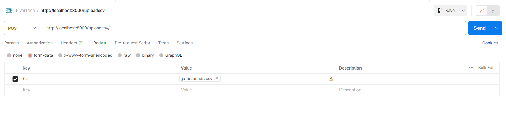
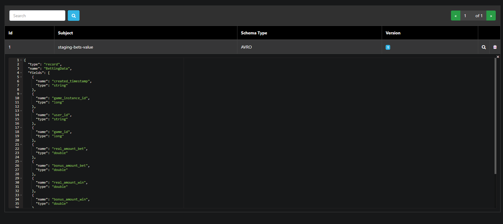
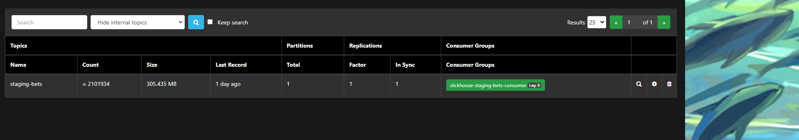
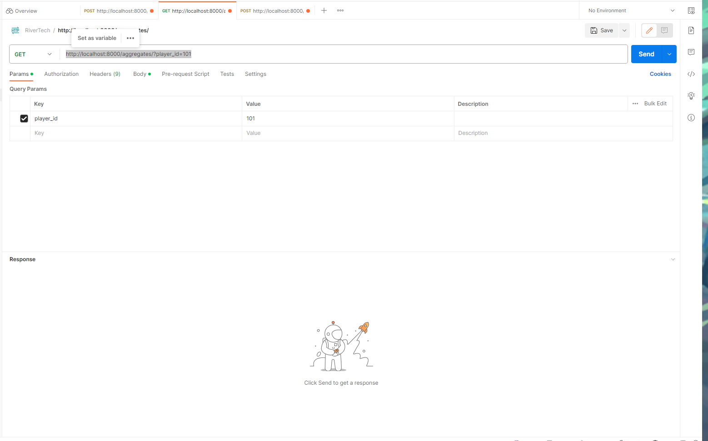
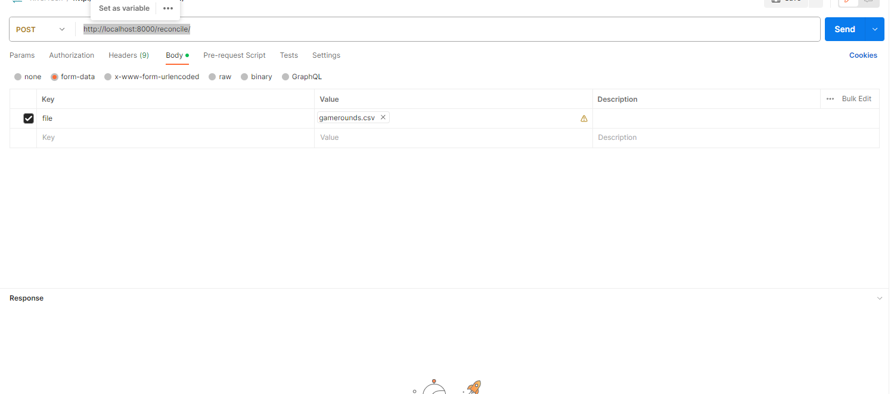

# REST API for CSV Data Processing

# Introduction

This documentation provides an explanation of my approach to develop a REST API for CSV Data Processing. As the task suggested I tackled each deliverables by breaking into various subtasks. The tasks where:

    1. Create an Uploader Endpoint
        - Use Avro Schema
        - Use Kafka Integration
    4. Use ClickHouse Integration
    5. Create an AggregationAPI Endpoint
    6. Create a ReconciliationAPI Endpoint

## Developer Notes
The programming language choosen was python as I am mostly familiar with this language. As this domain of knowledge is new to me I used tools such as chat-gpt, google and stack-overflow to research and understand the new technologies provided. 

# Setup
    1. Load dovker then use docker-compose up --build 
    2. After docker is loaded you can load tabix using localhost:8088
        - Host: http://localhost:8123
        - Login: default
    2. Go to the queries folder and run the clickhouse-sql-scripts in tabix to create the database game_rounds 
    3. Now we can use postman or curl to call our application

# Deliverables
The folder app hold a python application. The application first loads our schema from the schemas folder then registers this schema to kafka.The app uses fastapi to create a restfull api ,AvroProducer to manage kafka messges ,panda to manipualte data 
logging for debugging The app is made up of 3 api's:

## Uploader Endpoint : Create a REST API endpoint to handle CSV file uploads and perform validation.
Using postman you can upload the gamerounds.csv by calling  http://localhost:8000/uploadcsv/

    1. Once this is called the app check that the file extension of the file is of csv foramt
    2. Read the file current the the file uses utf-16 so we need to tell panda reader otherwise we get encoding errors.
    3. The we loop trough each record and validate to see that we have the correct fields if it's correct we send the message to Kafka.

I took the approach of sending one message at a time so that clickhouse can processes the messges as they get it. The queue , batch size and the time to send messages was set up the the avroproducer config so that we send 10000 messages at a time so the kafka server is not flooded. 

## Avro Schema: Define an Avro schema to match the structure of the CSV data and use a converter to transform CSV data into Avro records.

This schema can be found in the app schemas folder where the bets.avsc. This schema is registered when the app is started on line 87 "avroProducer = AvroProducer(AvroProducerConf, default_value_schema=betting_data_avro_schema)"

## Kafka Integration: Implement a Kafka producers in your microservice to publish the Game Round Avro messages to a Kafka topic named `staging-bets`.

Using the default settings AvroProducer was used to publish the messages to the staging-bets topic on line 105 "avroProducer.produce(topic=topic, value=record,callback=delivery_report)"

## ClickHouse Integration: Set up a ClickHouse database and tables to consume, store data, and implement the materialized views for fact aggregation for the game round data. The aggregation should also be grouped `hourly` by `player_id` and `game_id`.

In the queries folder there are 5 queries that we need for the applciation to run: 

    1. Creates the database
    2. Creates the table for game rounds
    3. Create the materialized view for hourly aggregation
    4. Hook kafka stream to clickhouse so that messages are read directly from Kafka
    5. Query to copy from the stream table to our table game_rounds

    

## AggregationAPI Endpoint: Develop endpoints that allow users to retrieve precomputed aggregates from ClickHouse. The endpoint should allow filtering and pagination by `player_id` and `game_id`. Additionally, the endpoint should also allowed to filtering by `date range`

Using postman you can upload the gamerounds.csv by calling  http://localhost:8000/aggregates/

This api allows filtering byplayer_id ,game_id,date_from,date_to and skip ,limit for pagination

    1. Once this is called the app check if any of the query strings are set and they are used to filter the data accordingly.
    2. Then the clickhouse query is run using the clickhouse client and the result is sent back.

 Clickhouse also has it's own api wher one can send a query in a body message and jsut query the data needed without providing any extra api , this would have been also a viable solution.   

## ReconciliationAPI Endpoint: Create an endpoint to reconcile the original CSV data with computed aggregates in Clickhouse. 
Using postman you can upload the gamerounds.csv by calling  http://localhost:8000/reconcile/

This api allows the user to check if all the csv data has been uploaded. 
    1. Once the api is called the csv file is uploaded into a temp folder
    2. This is done as the reconciliation takes quite some time so due to http timeouts the process is run as a background worker.
    3. The the file is split into chuncks of 500 so we don't overlaod the memory 
    4. Sort the file data and the databse date using the same ordering. 
    5. Then we comapre the first 500 csv recors to the first 500 database records and log if there are any discrepancies in the app by creating a file named reconciliation_function.log. Where we store out result

# Future enhancments
    1. I would add an authorization layer so that out data is secure.
    2. Learn more about the various technologies so I can fine tuen configuration so that kafa messages can be run in parallel
    3. Add a check for already processed messages so no data is duplicated.
    4. Add code to remove temp files from ther server when finsihed
    4. I would ask for feedback from more experienced collegaues 

Thank you and well done this technical test was really well written .Please pass your feedback both good and bad so that I can learn from the experience. IOf you have any furthery questions or need help in the setup to run this project please do not hesitate to conntact me on mattxuer@gmail.com