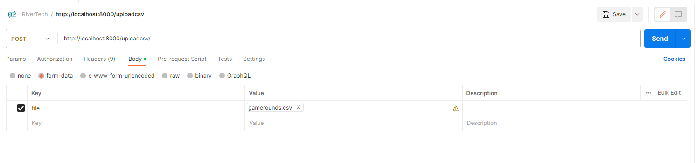
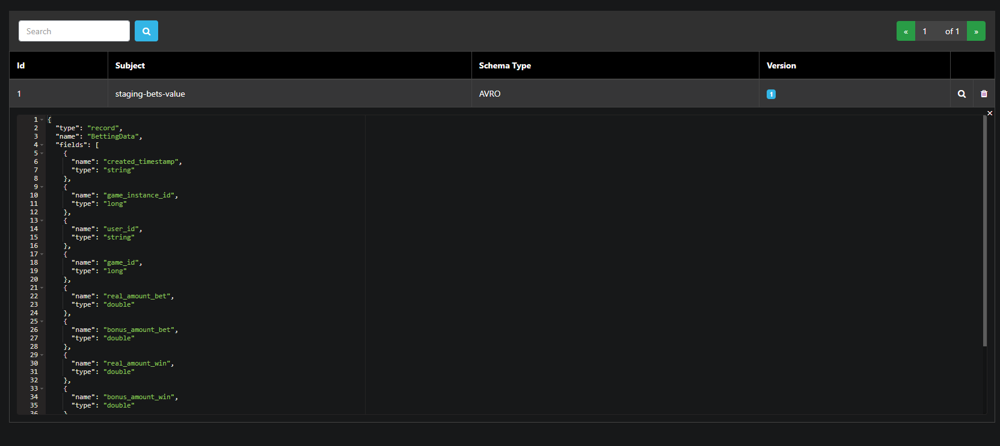
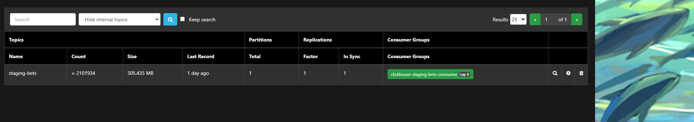
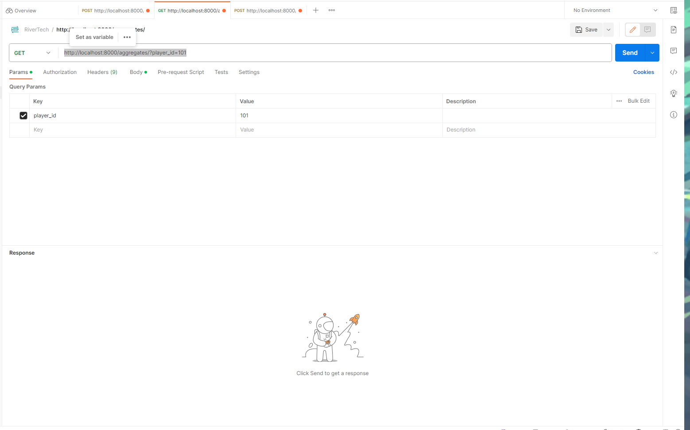
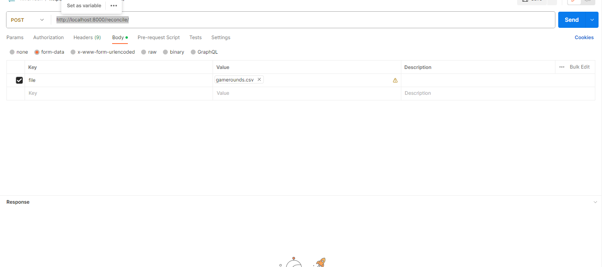
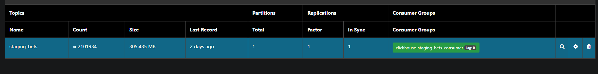
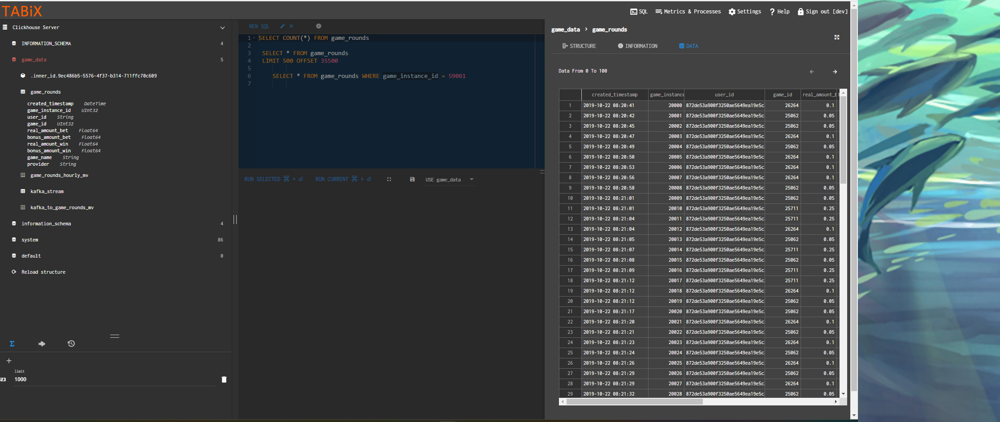
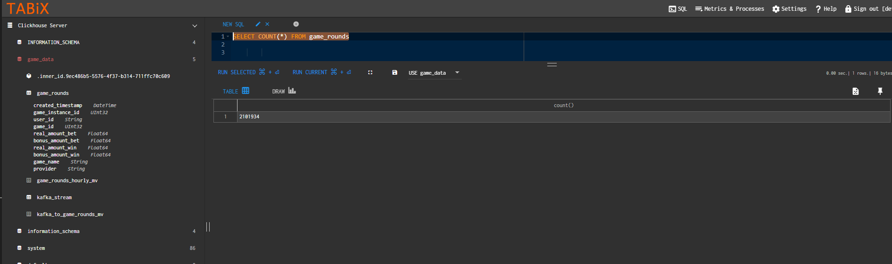
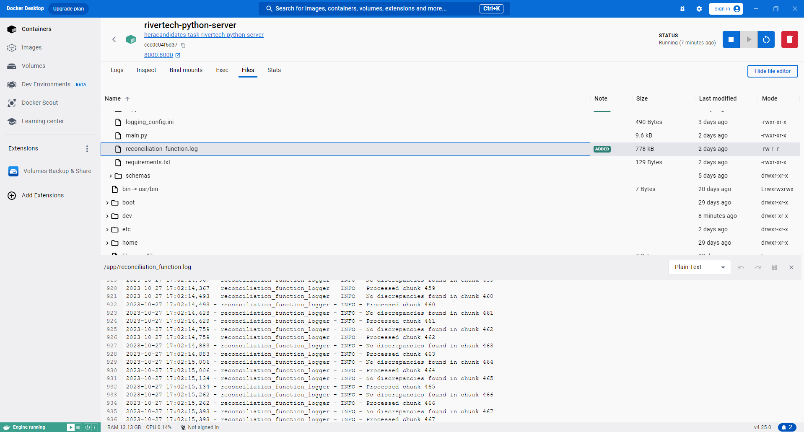

# REST API for CSV Data Processing

# Introduction

This documentation provides an explanation of my approach to develop a REST API for CSV Data Processing. As the task suggested I tackled each deliverable  by breaking into various subtasks. The tasks where:

    1. Create an Uploader Endpoint
        - Use Avro Schema
        - Use Kafka Integration
    4. Use ClickHouse Integration
    5. Create an AggregationAPI Endpoint
    6. Create a ReconciliationAPI Endpoint

## Developer Notes

The programming language chosen was python as I am mostly familiar with this language and it offers a lot of libraries that allows to work with large datasets. As my domain of knowledge is new to me I used tools such as chat-gpt, google and stack-overflow to research and understand the new technologies provided. 

# Setup

    1. Load Docker then use docker-compose up --build 
    2. After docker is loaded you can load Tabix using localhost:8088
        - Host: http://localhost:8123
        - Login: default
    3. Go to the queries folder and run the ClickHouse-sql-scripts in Tabix to create the database game_rounds 
    4. Now we can use postman or curl to call our application

# Deliverables

The folder app holds a python application. The application first loads our schema from the schemas folder then registers this schema to kafka.The app uses fastapi to create a Rest Api , AvroProducer to manage Kafka messages , Pandas to transform data and logging for debugging. The app is made up of 3 api's:

## Uploader Endpoint : Create a REST API endpoint to handle CSV file uploads and perform validation.

Using postman you can upload the gamerounds.csv by calling  http://localhost:8000/uploadcsv/

    1. Once this is called the app makes sure the file type is of .csv format.
    2. Read the file (currently the file uses utf-16 so we need to tell panda reader otherwise we get encoding errors.)
    3. Then the app loops trough each record, validates it and if it's valid  it is sent to Kafka.

### Notes:

I took the approach of sending one message at a time so that ClickHouse can process  the messages  as they get it. The queue , batch size and the time to send messages was set up the the AvroProducer config so that we send 10000 messages at a time so the kafka server is not flooded. 

## Avro Schema: Define an Avro schema to match the structure of the CSV data and use a converter to transform CSV data into Avro records.

This schema can be found in the app schemas folder where the bets.avsc. This schema is registered when the app is started on line 87 "avroProducer = AvroProducer(AvroProducerConf, default_value_schema=betting_data_avro_schema)"

## Kafka Integration: Implement a Kafka producers in your microservice to publish the Game Round Avro messages to a Kafka topic named `staging-bets`.

Using the default settings AvroProducer was used to publish the messages to the staging-bets topic on line 105 "avroProducer.produce(topic=topic, value=record,callback=delivery_report)"

## ClickHouse Integration: Set up a ClickHouse database and tables to consume, store data, and implement the materialized views for fact aggregation for the game round data. The aggregation should also be grouped `hourly` by `player_id` and `game_id`.

In the queries folder there are 5 queries that we need for the app to run: 

    1. Creates the database
    2. Creates the table for game rounds
    3. Create the materialized view for hourly aggregation
    4. Hook kafka stream to ClickHouse so that messages are read directly from Kafka
    5. Query to copy from the stream table to our table game_rounds

    

## AggregationAPI Endpoint: Develop endpoints that allow users to retrieve precomputed aggregates from ClickHouse. The endpoint should allow filtering and pagination by `player_id` and `game_id`. Additionally, the endpoint should also allowed to filtering by `date range`

Using postman you can upload the gamerounds.csv by calling  http://localhost:8000/aggregates/

This api allows filtering byplayer_id ,game_id,date_from,date_to and skip ,limit for pagination

    1. Once this is called the app check if any of the query strings are set and they are used to filter the data accordingly.
    2. Then the ClickHouse query is run using the ClickHouse client and the result is sent back.

 ClickHouse also has its own api where one can send a clcikhouse query in a body message and just query the data needed without providing any extra api layer, this would have been also a viable solution.   

## ReconciliationAPI Endpoint: Create an endpoint to reconcile the original CSV data with computed aggregates in ClickHouse. 
Using postman you can upload the gamerounds.csv by calling  http://localhost:8000/reconcile/

This api allows the user to check if all the csv data has been uploaded. 
    1. Once the api is called the csv file is uploaded into a temp folder
    2. This is done as the reconciliation takes quite some time so due to http timeouts the process is run as a background worker.
    3. The the file is split into chunks of 500 so we don't overload the memory 
    4. Sort the file data and the database date using the same ordering. 
    5. Then we compare the first 500 csv records to the first 500 database records and log if there are any discrepancies in the app by creating a file named reconciliation_function.log. Where we store out result

## Proof of Work.

### CSV uploaded to Kafka ###

Csv had 2101934 records and Kafka shows 2101934 messages uploaded

### Kafa messages consumed by ClickHouse ###

Data has been consumed by Kafka

A count query that shows that ClickHouse holds 2101934 records

### Reconciliation Report ###

A log file showing that the csv records are found on ClickHouse

# Future enhancements

    1.Security: I would add an authorization layer on top of the Rest Api so that the Api can be only requested by authorized users (https://fastapi.tiangolo.com/tutorial/security/).
    2.Performance Tuning: Learn more about the various technologies so I can fine tune configurations for ClickHouse and Kafka.
        - Parallel running of Kafka messages. 
        - Load testing the kafka messaging system to make sure messages are not lost
    3.Data Duplication: Add a check for already processed messages so no data is duplicated.
        - Checking if the file is already uploaded.
        - Checkign if the record already exists in ClickHouse database. 
    4.Cleanup: Add code to remove temp files from the server when finished. 
        - This should be done as otherwise the server can run out disk space and our reconsilation process would fail as disk full error would be thrown.
    6.Automation: 
        - Add a CI/CD pipline to deploy the solution
        - Add Cleanup operation for temp files 
        - Add archiving procedure for reconsilation files

# Conclusion

Thank you for the opportunity to tackle this technical test, which has been both challenging and great learning experience. I've gained valuable insights into data processing with Kafka, Avro, and ClickHouse, and I'm keen to refine my skills further based on your feedback.

I welcome any comments or suggestions on my work, as I am committed to continuous learning and improvement. For any questions or assistance needed to run the project, please contact me at mattxuer@gmail.com.
